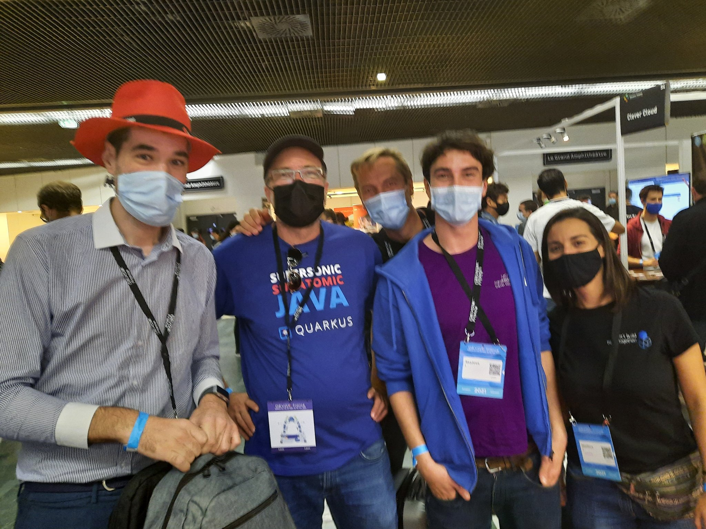
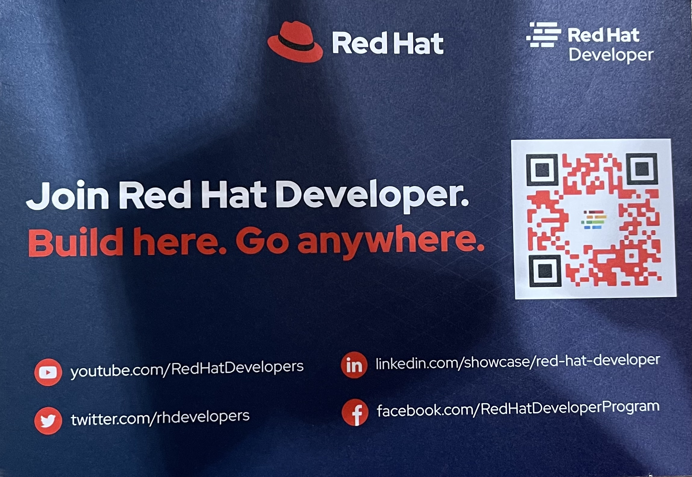
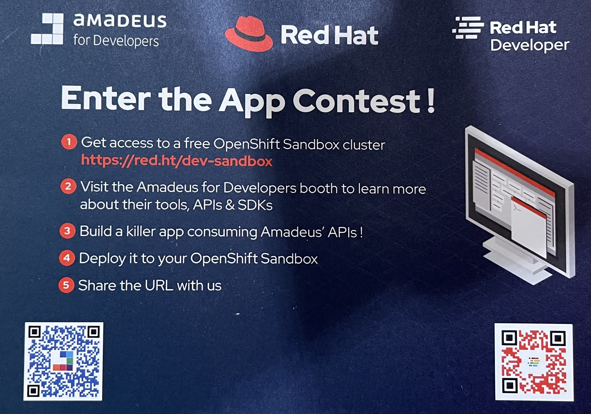
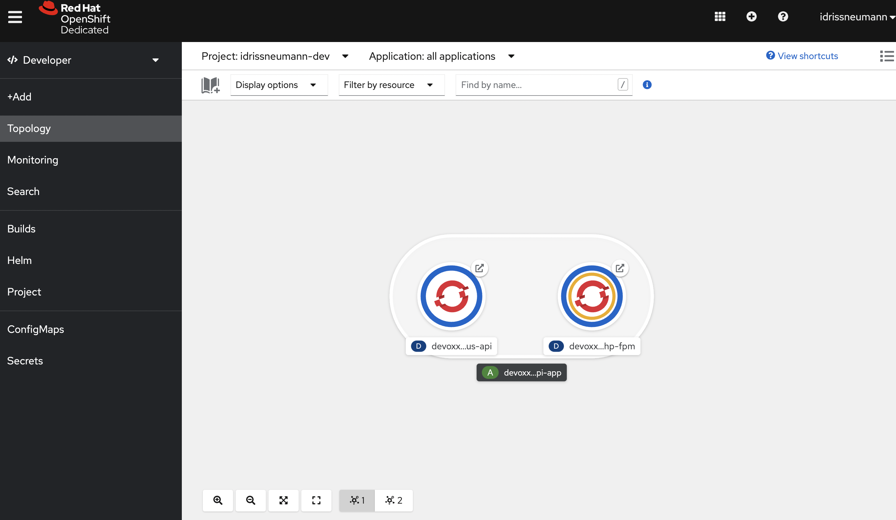
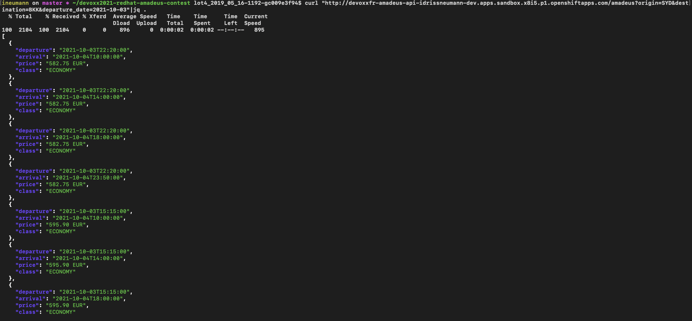
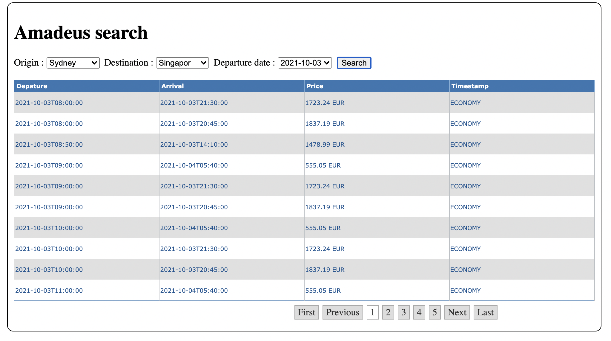

# DevoxxFR RedHat for developer's and Amadeus contest

Here's the dummy application that allow me to won this challenge at DevoxxFR 2021 (9 3/4)!

The application is deployed here: 
* UI: https://devoxx2021-redhat-amadeus-contest-ui.comwork.io
* Restful API: https://devoxx2021-redhat-amadeus-contest-api.comwork.io



## Instructions





## Used technologies

* Python Flask Restful for the backend part
* Plain old fascion JQuery and php for the frontend part
* Docker of course, as always :p
* Gitlab-ci for building and deliver the images
* Amadeus API SDK: https://github.com/amadeus4dev/amadeus-python
* RedHat developer sandbox: https://developers.redhat.com/developer-sandbox

## Images available on the docker hub

The images are available here:
* https://hub.docker.com/r/comworkio/devoxxfr-amadeus-api
* https://hub.docker.com/r/comworkio/devoxxfr-amadeus-ui-fpm
* https://hub.docker.com/r/comworkio/devoxxfr-amadeus-ui-nginx

## Local deployment with docker-compose

```shell
$ cp .env.dist .env #replace the variable content by your own credentials
$ docker-compose up -d --force-recreate
```

Then you can go to:
* http://localhost:8011 : for the api
* http://localhost:8012 : for the frontend

## Openshift deployment







The application is also deployed on my own infrastructure (with the same containers images): 
* UI: https://devoxx2021-redhat-amadeus-contest-ui.comwork.io
* Restful API: https://devoxx2021-redhat-amadeus-contest-api.comwork.io
